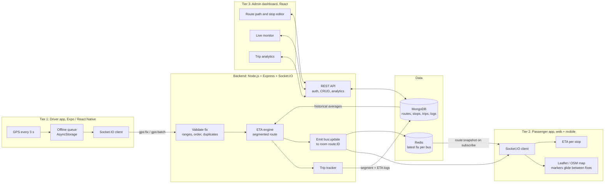

# System architecture

Smart Bus Tracking and Arrival Prediction System: three client tiers around one Node.js backend. A driver's phone is the only tracking hardware.

## Data flow for one GPS fix

1. The driver app captures a position every 3 seconds while on duty and emits `gps:fix` (`lat`, `lng`, `speed` in m/s, `heading`, `accuracy`, `ts` device time in ms, `seq`).
2. The server validates it (`backend/lib/validate.js`): coordinate ranges, a required timestamp that is not in the future or older than a day, a plausible speed. A fix whose timestamp is not newer than the bus's last accepted fix is dropped as a duplicate or out-of-order fix. A fix implying an impossible jump is rejected.
3. The ETA engine (`backend/lib/eta.js`) computes the arrival time at every stop (see below).
4. The result is written to the latest-fix cache (`bus:<busId>:last`, 60 s TTL) and emitted as `bus:update` to the Socket.IO room `route:<routeId>`.
5. The raw fix is appended to an in-memory buffer that is written to MongoDB (`GpsLog`) every 5 seconds, so the live path never waits on a database write.

A passenger who selects a route emits `route:subscribe`. The server moves the socket into that route's room and replies with `route:snapshot`, read from the cache, so the map shows buses immediately.

## ETA engine

Each route has a road polyline and an ordered list of stops. Consecutive stops define segments. For each fix:

| Step | What happens | Code |
|---|---|---|
| (a) | Project the position onto the nearest point of the polyline | `projectOntoLine` in `lib/geo.js` |
| (b) | Find the active segment and the road distance left in it | `computeEta` |
| (c) | Time for the current segment = remaining distance / current speed. If the bus is stopped or crawling (under 1.5 m/s), the segment's usual speed is used | `computeEta` |
| (d) | For each later segment add its historical average traversal time, plus the average dwell time at each stop passed on the way | `computeEta` |

Historical values are averages of `SegmentLog` records for that route and segment. A segment with no history uses 20 km/h and a 20 second dwell. Distances follow the road polyline, not a straight line between points.

## Trip history and evaluation data

The trip tracker (`lib/tripTracker.js`) watches each bus's progress:

- When a bus crosses from one segment to the next it writes a `SegmentLog` (traversal seconds, dwell seconds). Dwell is time spent under 1.5 m/s within 40 m of a stop. A segment the bus joined part-way is not logged.
- When a bus leaves a stop, the predicted arrival at every later stop is remembered. On arrival an `EtaLog` is written with predicted time, actual time and the error.

## Offline buffer

If the connection drops, the driver app queues fixes (persisted in AsyncStorage, capped at 2000, about 100 minutes). On reconnect it sends them oldest-first as `gps:batch` in chunks of 500 and removes a chunk only after the server acknowledges it. If an acknowledgement is lost the chunk is sent again and the server discards the repeats by timestamp. Buffered fixes update trip history, but only the newest fix of a batch is shown to passengers.

## Authentication

Passwords are stored as scrypt hashes. Login returns a JWT with a `role` claim (`admin`, `driver` or `passenger`). Admin REST endpoints require an admin token. Driver sockets must present a driver token before `gps:fix` is accepted. Reading routes and subscribing to a route room are open.

## Known limits

- The in-process bus state (trip progress, last fix) lives in one server process. Running several API instances would need that state moved into Redis and the Socket.IO Redis adapter.
- A route that crosses or doubles back on itself is handled by searching near the bus's last position, which assumes fixes arrive regularly.
- Background GPS needs an installed build (APK). Expo Go only tracks while the app is open.
- A route is one direction of travel. A bus driving back along the same road is projected onto the outbound path, so its stop ETAs are wrong until it is near the first stop again. Model the return leg as its own route and assign the bus to it for the return trip.
- Going off duty closes the open trip and resets the bus's position state. The next duty period starts a new trip.
