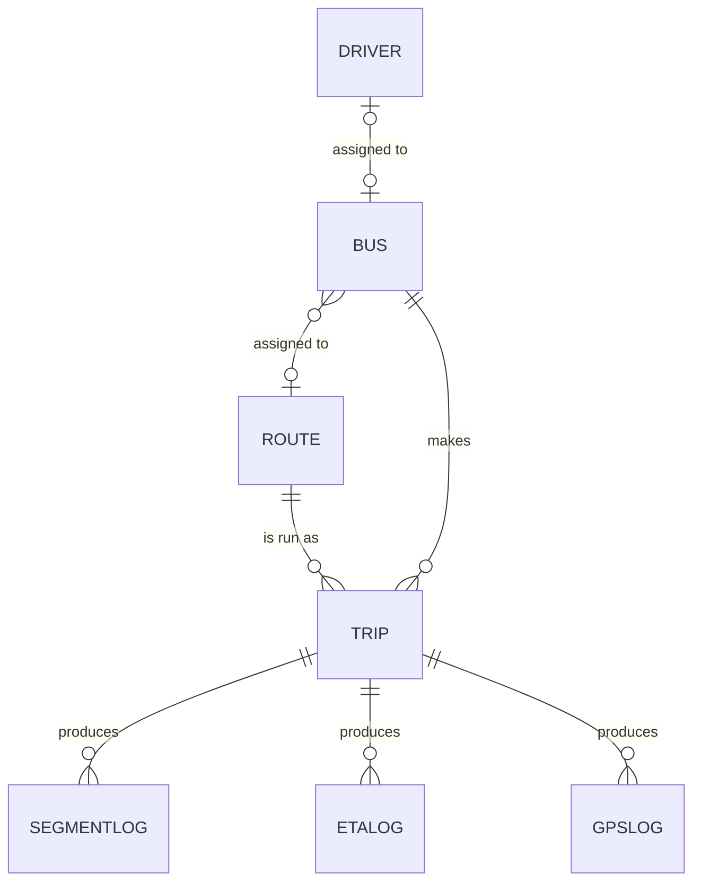

# Database schema

MongoDB database `smart_bus_tracking`. Models are in `backend/models/`. All main collections have `createdAt` and `updatedAt`.

## Collections

### routes

| Field | Type | Notes |
|---|---|---|
| `routeId` | String, unique | `RT-001`, generated |
| `routeNumber` | String | Public number, e.g. `138` |
| `name`, `start`, `end` | String | |
| `distance` | Number | km |
| `path` | GeoJSON `LineString` | Road geometry, coordinates `[lng, lat]`. **2dsphere index** |
| `stopPoints` | Array of `{ name, location: GeoJSON Point }` | Stops in travel order. Consecutive stops define the ETA segments. **2dsphere index** on `stopPoints.location` |
| `stops` | [String] | Stop names, kept in step with `stopPoints` |
| `assignedBus` | String | `"<registration> (<busId>)"` |
| `status` | `Active` / `Inactive` / `Under Construction` | |

### buses

| Field | Type | Notes |
|---|---|---|
| `busId` | String, unique | `BUS-001`, generated |
| `registration` | String, unique | Driver app login name |
| `capacity`, `mileage` | Number | |
| `password` | String | scrypt hash. Never returned by the API |
| `assignedDriver` | String | `driverId` of the assigned driver |
| `status` | `Active` / `Idle` / `Maintenance` | |

### drivers

`driverId` (unique, `DRV-001`), `name`, `license` (unique), `expiry`, `phone`, `status` (`Active` / `Inactive` / `On Leave`).

### admins and passengers

| Collection | Fields |
|---|---|
| `admins` | `username` (unique), `password` (scrypt hash), `name`, `role` |
| `passengers` | `username` (unique, lowercase), `password` (scrypt hash), `name`, `phone` |

### trips

One run of a bus along its route: `tripId` (unique), `busId`, `registration`, `routeId`, `startedAt`, `endedAt`, `completed`.

### segmentlogs

One measured crossing of a segment. The averages are the ETA engine's historical baseline.

| Field | Notes |
|---|---|
| `routeId`, `segIndex` | Segment `i` runs from stop `i` to stop `i+1`. Compound index |
| `tripId`, `busId` | |
| `traversalSec` | Moving time across the segment |
| `dwellSec` | Time under 1.5 m/s within 40 m of a stop |
| `at` | When the bus finished the segment |

### etalogs

Predicted versus actual arrival at a stop: `routeId`, `tripId`, `busId`, `stopIndex`, `predictedAt`, `predictedArrival`, `actualArrival`, `horizonSec` (how far ahead the prediction was made), `errorSec` (predicted minus actual).

### gpslogs

Raw accepted fixes: `busId`, `routeId`, `tripId`, `location` (GeoJSON Point, **2dsphere index**), `speed`, `heading`, `deviceTs`, `serverTs`, `buffered`. A TTL index on `serverTs` deletes records after 14 days.

### counters

`name`, `seq`: sequence numbers for the generated ids.

## Redis keys

| Key | Type | TTL | Purpose |
|---|---|---|---|
| `bus:<busId>:last` | String (JSON `busUpdate`) | 60 s | Latest fix and ETAs for one bus |
| `route:<routeId>:buses` | Set of bus ids | – | Which buses to read for a route snapshot |
| `buses:active` | Set of bus ids | – | All buses with a cached fix |

Without `REDIS_URL`, or if Redis cannot be reached at startup, the same data is kept in process memory. That fallback is for local development only.

## Relationships

